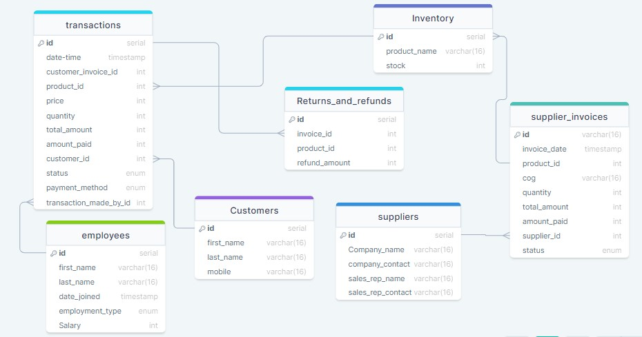

# Design Document

By Kalindu Gayan Liyanage Don

Video overview: <https://youtu.be/njvZBMmvvYY>

## Scope
* What is the purpose of your database?

The purpose of this database is to facilitate the management of transactions, inventory, suppliers, customers, employees, and returns/refunds for a retail business. It allows tracking of sales, purchases, stock levels, customer information, supplier information, employee details, and financial transactions.

* Which people, places, things, etc. are you including in the scope of your database?

Transactions:
    Records of sales transactions made by customers, including details such as product sold, quantity, price, payment method, and status.
Inventory:
    Tracks the available products in stock along with their respective quantities.
Supplier Invoices:
    Records invoices from suppliers for purchased goods, detailing the products, quantities, costs, and payment status.
Suppliers:
    Stores information about the suppliers, including company name, contact details, and sales representatives.
Customers:
    Stores information about customers, including names, contact details, and any transactions made.
Returns and Refunds:
    Tracks returns and refunds initiated by customers, including details of the returned products and refund amounts.
Employees:
    Stores information about employees, including names, dates of joining, employment type, and salary.
Excluded Entities

* Which people, places, things, etc. are *outside* the scope of your database?

Detailed financial records beyond transaction amounts and status.
Complex sales analysis and forecasting functionalities.

## Functional Requirements
* What should a user be able to do with your database?

View Transactions:
    Users can view details of past transactions, including sales made, products sold, and payment status.
Manage Inventory:
    Users can add, update, and delete products from the inventory.
Handle Supplier Transactions:
    Users can manage supplier invoices, mark them as paid, and update supplier information.
Track Customer Information:
    Users can view customer details, track their purchases, and handle returns/refunds.
Manage Employees:
    Users can add, update, and remove employee records, including salary adjustments.
Generate Reports:
    Users can generate reports on inventory levels, sales trends, and outstanding payments.

* What's beyond the scope of what a user should be able to do with your database?

Advanced analytics and forecasting features.
Integration with external financial systems.

## Representation

### Entities

* Transactions

Attributes:
    customer_invoice_id, datetime, product_id, price, quantity, total_amount, amount_paid, customer_id, status, payment_method, transaction_made_by_id.
Types:
    INTEGER, NUMERIC, TEXT.
Constraints:
    NOT NULL for essential fields, appropriate data types for numeric and text fields, check constraints for status and payment_method.

* Inventory

Attributes:
    id, product_name, stock.
Types:
    INTEGER, TEXT, INT.
Constraints:
    NOT NULL for all fields, PRIMARY KEY on id for uniqueness.

* Supplier Invoices

Attributes:
    id, invoice_date, product_id, cog, quantity, total_amount, amount_paid, supplier_id, status.
Types:
    TEXT, NUMERIC, INTEGER, REAL.
Constraints:
    NOT NULL for essential fields, PRIMARY KEY on id, FOREIGN KEY references to inventory and suppliers.

* Suppliers

Attributes:
    id, company_name, company_contact, sales_rep_name, sales_rep_contact.
Types:
    INTEGER, TEXT, INTEGER.
Constraints:
    NOT NULL for essential fields, PRIMARY KEY on id for uniqueness.

* Customers

Attributes:
    id, first_name, last_name, mobile.
Types:
    INTEGER, TEXT, NUMERIC.
Constraints:
    NOT NULL for essential fields, PRIMARY KEY on id for uniqueness.

* Returns and Refunds

Attributes:
    id, invoice_id, product_id, refund_amount.
Types:
    INTEGER, INTEGER, INTEGER, REAL.
Constraints:
    NOT NULL for essential fields, PRIMARY KEY on id.

* Employees

Attributes:
    id, first_name, last_name, date_joined, employment_type, salary.
Types:
    INTEGER, TEXT, NUMERIC, TEXT, INTEGER.
Constraints:
    NOT NULL for essential fields, PRIMARY KEY on id.

### Relationships

In this section you should include your entity relationship diagram and describe the relationships between the entities in your database.

* Relationship Diagram

One-to-Many Relationship:==

-Transactions to Inventory (One product can appear in many transactions).
-Supplier Invoices to Inventory (One product can appear in many supplier invoices).
-Transactions to Customers (One customer can have multiple transactions).
-Returns and Refunds to Transactions (One transaction can have multiple returns/refunds).
-Supplier Invoices to Suppliers (One supplier can issue multiple invoices).

## Optimizations

In this section you should answer the following questions:

* Which optimizations (e.g., indexes, views) did you create? Why?

- Indexes

Created indexes on frequently queried columns to optimize retrieval performance.
    Index on transactions for customer_id and product_id.
    Index on supplier_invoices for product_id and supplier_id.
    Index on returns_and_refunds for invoice_id and product_id.

- Views

Created views to provide summarized information:
    Debtors: Details of customers with pending payments.
    Creditors: Details of suppliers with pending payments.
    Stock Threshold: Products with low stock levels for proactive inventory management.

## Limitations

* Design Limitations
    -Lack of detailed financial records beyond transaction amounts and status.
    -Limited historical data for trend analysis and forecasting.

*Representational Limitations
    -May not represent complex sales analysis or forecasting functionalities efficiently.
    -Might not accommodate large-scale data analysis due to the simplicity of the design.

* Performance Limitations
    -Performance may degrade with a significant increase in data volume without appropriate optimizations.
    -Lack of complex indexing or partitioning strategies may impact query performance over time.

* Scope Limitations
    -Excludes advanced features such as user authentication, authorization, and role-based access control.
    -Does not include integration with external systems like accounting software or CRM platforms.

* Conclusion

While the database design fulfills the basic requirements of a retail business, it has inherent limitations due to its simplicity and scope. However, with careful management and periodic optimizations, it can efficiently handle day-to-day operations and provide valuable insights into sales, inventory, and customer behavior.
